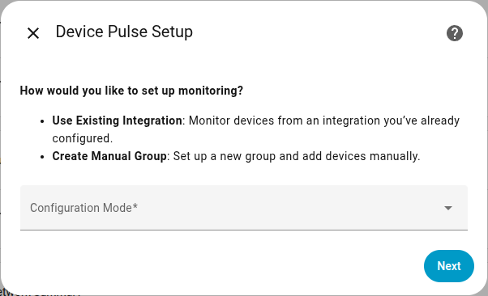
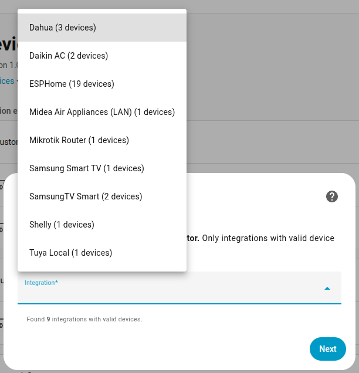
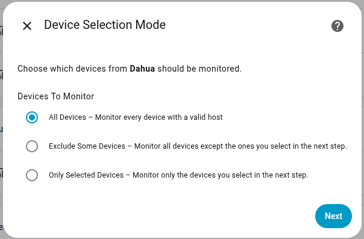
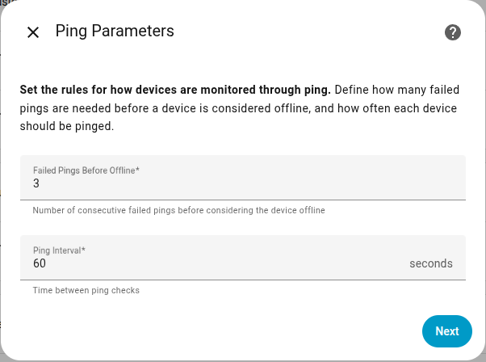
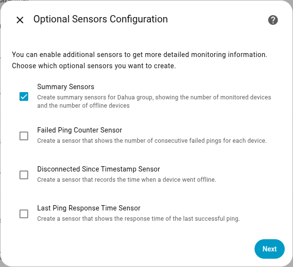

# Device Pulse

## Introduction

Device Pulse is a custom Home Assistant integration that provides flexible monitoring of IP-based devices. It offers two configuration modes to track network device availability through ping checks and automatically generates summary sensors for quick visibility of connection states.

---

## Basic Functionality

### Configuration Modes

1. **Integration-based Monitoring**\
   Device Pulse can automatically detect existing Home Assistant integrations that expose device connection parameters such as `ip_address`, `ipaddress`, `host`, `hostname`, or `address`.\
   You can then select one of these integrations to monitor its devices.

<p float="left">
  
  
</p>

   During setup, you can specify which devices to monitor:   

   - **All valid devices** – all devices with a valid host parameter.
   - **All except listed devices** – exclude specific devices listed during configuration.
   - **Only listed devices** – include only the specified devices.

<p float="left">
  
</p>

2. **Custom Group Monitoring**\
   You can manually create a custom group and add devices by specifying their **name** and **host (hostname or IP)**. Each group can be configured independently.


### Monitoring Parameters

For both configuration modes, you can define:

- The **number of failed ping attempts** required before a device is considered disconnected.
- The **interval time** between each ping request.

<p float="left">
  
</p>

---

## Advanced Features

### Optional Supplementary Sensors

You can choose to create additional sensors for each monitored device to track:

- The number of failed pings.
- The timestamp of the last offline event.
- The round-trip time of the most recent ping.

<p float="left">
  
</p>

### Summary Sensors per Integration or Group

Each integration or custom group can have two summary sensors:

- The **total number of monitored devices**.
- The **number of offline devices**.

### Global Summary Sensors

Device Pulse automatically creates three global summary sensors:

1. A sensor for the **total number of devices** under monitoring.
2. A **binary sensor** indicating whether all devices are online.
3. A sensor showing the **total number of offline devices**.

### Attributes for Offline Summary Sensors

Sensors that track the number of offline devices (both per group and globally) expose three attributes:

- `offline_device_ids`: list of device IDs currently offline.
- `went_offline_device_ids`: list of device IDs that went offline in the most recent update.
- `came_online_device_ids`: list of device IDs that came back online in the most recent update.

These attributes allow for easy automation and dynamic UI cards showing current offline devices.

### Custom Events

Device Pulse emits three custom events that can be used for advanced automations and tracking device state changes:

- `device_pulse_ping_status_updated`: Triggered whenever the ping status of any monitored device sensor changes (from online to offline or vice versa).
- `device_pulse_device_went_offline`: Triggered when a device transitions from online to offline. The event data includes the device ID.
- `device_pulse_device_came_online`: Triggered when a device transitions from offline back to online. The event data includes the device ID.

These events can be used in automations to trigger notifications, log changes, or synchronize external systems with real-time network status.

---

## Device Pulse Timeline Custom Card

A companion custom Lovelace card named `device-pulse-timeline` is available in the repository `REPO`.
This card displays a visual timeline of connection and disconnection events for each monitored device, providing an intuitive historical view of network stability and device uptime.

<!-- The card can be added to your dashboard as a standard custom card once installed and configured through HACS or manual setup. -->

---

## Example Automation

```yaml
# Example: Notify when any monitored device goes offline or comes back online
# TODO
```

---

## Example Lovelace Card

```yaml
# Example: Card showing the list of currently offline devices
# TODO
```

